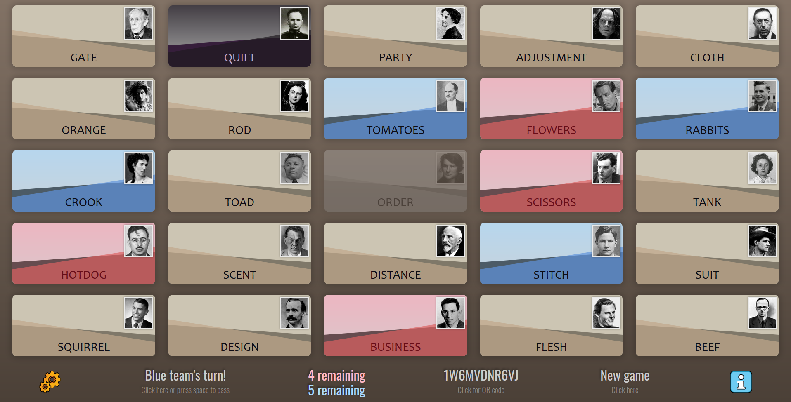

# 🕵️ Spymaster 🕵️
An offline browser-based game similar to "Codenames" written in Elm.

## Objective
Two teams take turns receiving clues and picking words from a set of cards until one team has found all of their words or the *Assassin* is selected.

## Detailed rules
An algorithm selects an underlying set of words that belong to each team: 9 words for the team to go first, and 8 words for the team to go second. One player on each team is selected as the "Spymaster", and she has access to the decoded game board that shows which words belong to her team.

Her job each turn is to provide one word and one number that connects as many words as possible for her team to guess. The number plus one determines the maximum number of words that team may guess this turn. At any time, a team can pass, and the other team's Spymaster has the same opportunity. If a team selects a word that does not belong to their team, their turn is over.

Each guess is completed by selecting a card to learn which "team" it belongs to. If the *Assassin* is selected, the team loses immediately.

## The Spymaster Decryptor
A separate application, found at `./spymaster/index.html`, is used for decrypting the game board. A link to the Decryptor is also provided in the :information_source: information panel. The necessary password is found at the bottom of the main application, and if entered correctly into the Decryptor, 1 assassin, 17 team symbols, and 7 spectator symbols will appear. The team with 9 cards goes first.

## Preview

<p align="center"></p>


## Compile
The Elm code has already been compiled into the Javascript that is used by `index.html`, but if additional changes are made, the source can be recompiled with

```elm make src/Spymaster.elm --output=assets/js/main.js && elm reactor```

## Legal note
The US Government's Form Letter 108 emphasizes that
> Copyright does not protect the idea for a game, its name or title, or the method or methods for playing it. Nor does copyright protect any idea, system, method, device, or trademark ma­terial involved in developing, merchandising, or playing a game. 

Accordingly, this software is provided under Version 3 of the GNU General Public License: you can redistribute it or modify it freely.